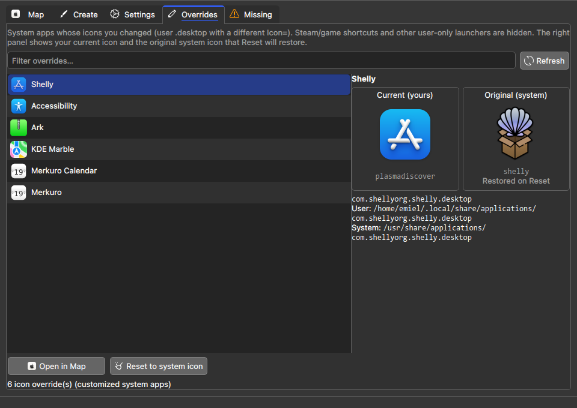
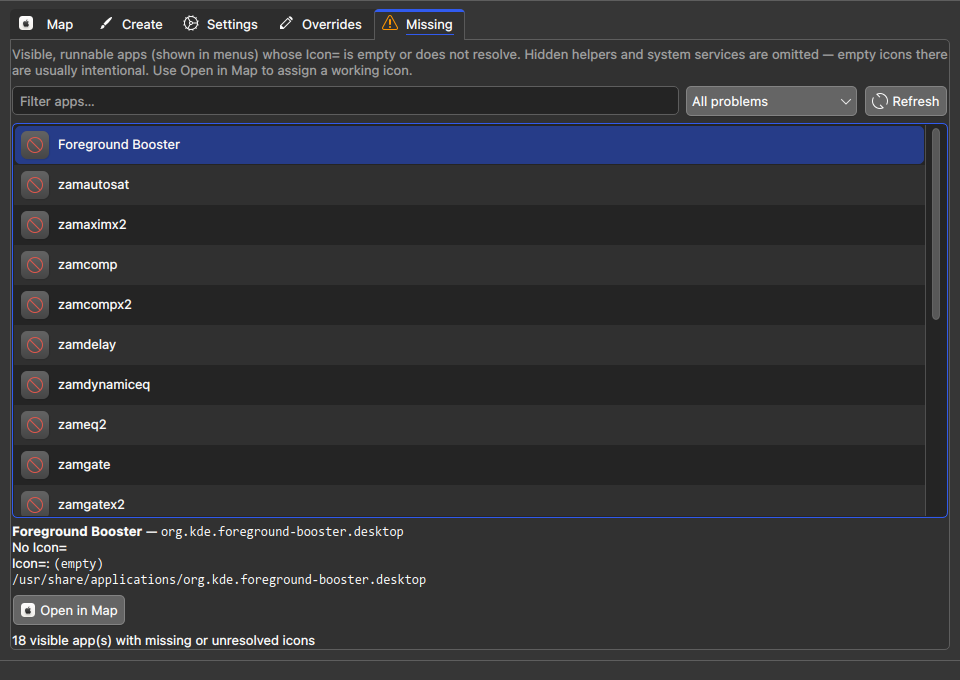

# kAppIcon

[](LICENSE)
[](#requirements)
[](#requirements)
[](#features)
[](#requirements)
[](https://github.com/rayman1972/kappicon/releases)

**Version 3.1** — change **Linux app launcher icons** without root.

**kAppIcon** is a small **icon manager** for **KDE Plasma** and other **freedesktop** desktops. Map a custom image, copy another app’s icon, or pick one icon from any installed **icon theme** (WhiteSur, Tela, Breeze, Papirus, …) and apply it to a single application — without switching your whole system theme.

It only edits **user-level** [desktop entries](https://specifications.freedesktop.org/desktop-entry-spec/) (`.desktop` files), installs custom icons into your personal **hicolor** theme when needed, and refreshes Plasma / GTK icon caches so menus and panels pick up the change.

| | |
|---|---|
| **GUI** | `kappicon` — Map · Create · Settings · Overrides · Missing |
| **CLI** | `kappicon-cli` — interactive terminal mapper (`fzf`) |
| **Install** | `./install.sh` → `~/.local/bin` (XDG paths; user-level by default) |
| **Source** | [github.com/rayman1972/kappicon](https://github.com/rayman1972/kappicon) |

### Quick install

```bash
git clone https://github.com/rayman1972/kappicon.git
cd kappicon
./install.sh
kappicon          # GUI
# kappicon-cli    # terminal
```

### Arch Linux (AUR)

```bash
# stable release
yay -S kappicon
# or latest git
yay -S kappicon-git
```

- [kappicon](https://aur.archlinux.org/packages/kappicon) — tagged release
- [kappicon-git](https://aur.archlinux.org/packages/kappicon-git) — latest `main`

PKGBUILDs are also kept in-tree under [`packaging/aur/`](packaging/aur/) (see [packaging/aur/README.md](packaging/aur/README.md) for updates).

## Screenshots

### Map — pick a file icon and an application


### Map — reuse another app’s icon


### Map — pick an icon from any installed theme pack

Browse packs such as **WhiteSur**, **Tela**, **Breeze**, or any theme under `~/.local/share/icons` / `/usr/share/icons`, then apply a single icon from that pack to any app — without switching your whole system theme.


### Create — pixel editor, import with pan/zoom, library

Draw or import, **Undo** / **Redo** on the canvas, then save a standard 512×512 icon to your library (or **Save and use in Map**).


### Settings — appearance, shape, backups


### Overrides — current vs system icon, reset

Review launchers you customized. The right panel shows **your** icon and the **original system** icon restored by Reset.



### Missing — visible apps with no usable icon

Only menu-visible, runnable apps with empty or unresolved `Icon=` (hidden helpers omitted). Open in Map to fix.



## Features

| Area | What you get |
|------|----------------|
| **Map · From file** | Assign downloaded or library images (PNG, ICNS, SVG, JPG, WEBP, …) to a launcher |
| **Map · From another app** | Copy the theme icon another installed app already uses |
| **Map · From icon theme** | Cross-use icons from **any installed icon theme pack** without changing the global theme |
| **Map · Stay open** | **Apply** does not close the window — list icon updates immediately; rice many apps in one sitting |
| **Map · Batch** | Ctrl/Shift multi-select apps → **Apply to N apps** (with confirm) |
| **Map · Undo** | Session **Undo last icon apply** (Edit menu / Ctrl+Z on Map); Create keeps canvas undo |
| **Map · Density & memory** | Compact / Comfortable / Large list icons; remembers source, filters, theme pack, last app |
| **Create** | Pixel canvas (pen / eraser / fill / picker); **import with pan/zoom**; always **512×512** library PNGs |
| **Drag and drop** | Drop an image onto the window to select it on Map or load Create — **never** auto-applies |
| **Overrides** | Review customized launchers with **current vs original** preview; open in Map or reset to system |
| **Missing** | Visible menu apps with empty or unresolved `Icon=` (skips hidden helpers); filter empty vs unresolved; jump to Map |
| **Shapes** | When applying custom images: as designed, or mask to square / rounded / circle |
| **Reset** | Restore an app’s system icon (Map and Overrides); preserves other desktop customizations when needed |
| **Backups** | Optional auto-backup of `.desktop` files before changes + restore UI (Undo can reverse a restore) |
| **CLI** | Terminal mapper with `fzf` (`kappicon-cli`); same user-level hicolor / lock contract for applies |
| **Safe by design** | User overrides only, exclusive apply lock, atomic writes, validated desktop ids, content-addressed custom icons |

Supported image types include **PNG, JPG, WEBP, SVG, ICNS, BMP, GIF, XPM**.

## Requirements

- Linux desktop (Plasma / Breeze-friendly; works elsewhere with freedesktop menus)
- **x86_64 and arm64** compatible (architecture-independent; needs deps for your arch)
- Python 3 + **PyQt6**
- **ImageMagick** (`magick` or `convert`) for rasterizing custom icons
- **icns2png** (`libicns` / `icnsutils`) for Apple `.icns` files
- **fzf** for the interactive CLI mapper (not required for `--help` / `--refresh` / `--restore`)
- **kdialog** (optional; native file dialogs / notifications on KDE)

## Installation

```bash
git clone https://github.com/rayman1972/kappicon.git
cd kappicon
./install.sh
```

To update later (from a git clone):

```bash
./install.sh --update
```

`install.sh` installs into `$XDG_BIN_HOME` (default `~/.local/bin`) and adds a desktop entry under `$XDG_DATA_HOME/applications`. It is **user-level only** by default (no sudo).

Install missing packages yourself, or opt in:

```bash
./install.sh --install-deps   # may use your package manager (sudo)
```

| Distro | Packages |
|--------|----------|
| **Arch / CachyOS** | `python python-pyqt6 libicns imagemagick kdialog fzf` |
| **Debian / Ubuntu** | `python3 python3-pyqt6 icnsutils imagemagick kdialog fzf` |
| **Fedora** | `python3 python3-pyqt6 libicns-utils ImageMagick kdialog fzf` |
| **openSUSE Leap / Tumbleweed** | `python3` `python3-PyQt6` (or `python3XY-PyQt6` for your Python) `libicns` `ImageMagick` `kdialog` `fzf` |

On openSUSE, `--install-deps` picks the PyQt6 RPM that matches your default `python3` when possible, and can fall back to `pip install --user PyQt6`.

Ensure your user bin dir (`$XDG_BIN_HOME`, default `~/.local/bin`) is on your `PATH`.

## Usage

### GUI

```bash
kappicon
```

Or open **kAppIcon** from the application menu.

**Tabs**

1. **Map** — choose the icon (step 1), the application (step 2), then **Apply** (window stays open)
   - *From file* — downloads, library, browse, or drag-and-drop
   - *From another app* — reuse the freedesktop theme icon another launcher already uses
   - *From icon theme* — pick an installed pack, filter its icons, apply one to a different app
   - Multi-select apps with Ctrl/Shift for a batch apply
   - **Edit → Undo last icon apply** reverts the last change in this session (Ctrl+Z on Map)
   - **Reset to system icon** when a system `.desktop` exists
2. **Create** — draw or import (pan/zoom) → **Save icon** or **Save and use in Map**
3. **Settings** — light/dark/system colors, applied icon shape, backups, source folder, restore, cache refresh
4. **Overrides** — review customized launchers with current vs original preview; open in Map or reset
5. **Missing** — visible, runnable apps with no usable icon (skips `NoDisplay`/hidden helpers); open in Map

### CLI

```bash
kappicon-cli --help
kappicon-cli              # interactive icon → app mapper (fzf + ImageMagick)
kappicon-cli --settings
kappicon-cli --restore
kappicon-cli --refresh
```

## Paths

Paths follow the [XDG Base Directory](https://specifications.freedesktop.org/basedir-spec/latest/) spec and [xdg-user-dirs](https://www.freedesktop.org/wiki/Software/xdg-user-dirs/) (localized Downloads/Pictures). Defaults match a typical Linux home layout.

| What | Where (default) | Env / override |
|------|-----------------|----------------|
| Config (Qt + CLI) | `$XDG_CONFIG_HOME/KAppIcon/` → `~/.config/KAppIcon/` | `XDG_CONFIG_HOME` |
| Created icons (library) | `$XDG_DATA_HOME/kappicon/icons/` | `XDG_DATA_HOME` |
| Desktop backups | `$XDG_DATA_HOME/kappicon/backups/` | `XDG_DATA_HOME` |
| Apply lock | `$XDG_DATA_HOME/kappicon/apply.lock` | `XDG_DATA_HOME` |
| User launcher overrides | `$XDG_DATA_HOME/applications/` | `XDG_DATA_HOME` |
| User hicolor theme icons | `$XDG_DATA_HOME/icons/hicolor/` | `XDG_DATA_HOME` |
| Installed binaries | `$XDG_BIN_HOME/` → `~/.local/bin/` | `XDG_BIN_HOME` |
| Source folder default | `xdg-user-dir DOWNLOAD` → `~/Downloads` | Settings / `source/folder` |
| Staged render PNGs | `xdg-user-dir PICTURES/KAppIcon` → `~/Pictures/KAppIcon/` | `XDG_PICTURES_DIR` |
| Theme packs (read-only) | `$XDG_DATA_HOME/icons/`, `~/.icons/`, `$XDG_DATA_DIRS/*/icons` | — |

## How it works

- Edits only your **user** `.desktop` overrides — system packages are left alone.
- *From another app* and theme **names** set `Icon=` to a freedesktop name so they follow theme resolution.
- Custom image files are installed under the user **hicolor** theme with **content-addressed** names (`kappicon-…`) so Apply / Undo never overwrite each other’s assets, and Plasma menus refresh reliably.
- Unreferenced `kappicon-*` assets are pruned under the same exclusive apply lock (launchers, backups, and session Undo keep their icons).
- SVG sources can stay vector when shape is *As designed*; other shapes re-export a masked 512×512 PNG.
- Reset restores the system icon when a package `.desktop` exists; if the override only changed `Icon=`, the user file is removed so the launcher follows future package updates again.

## Origins

kAppIcon grew out of **[macosicons-linux](https://github.com/system-rw/macosicons-linux)** by [System RW](https://github.com/system-rw) (MIT). Their project is a focused tool for mapping custom images (including macOS-style `.icns`) onto Linux launchers.

This repository continues under the same MIT license as a **substantial rework and expansion**: multi-source mapping (file / another app / installed icon theme packs), Create tab, Overrides and Missing, in-process apply with undo, safer restore/reset, XDG-aware install, and a rebranded GUI + CLI (`kappicon` / `kappicon-cli`). Thanks to the original author for the idea and the base that made this possible.

## Contributing

See [CONTRIBUTING.md](CONTRIBUTING.md). Please follow the [Code of Conduct](CODE_OF_CONDUCT.md).
Security reports: [SECURITY.md](SECURITY.md).

## License

MIT — see [LICENSE](LICENSE).

Copyright notices include the original author (System RW) and later substantial contributions in this project.
