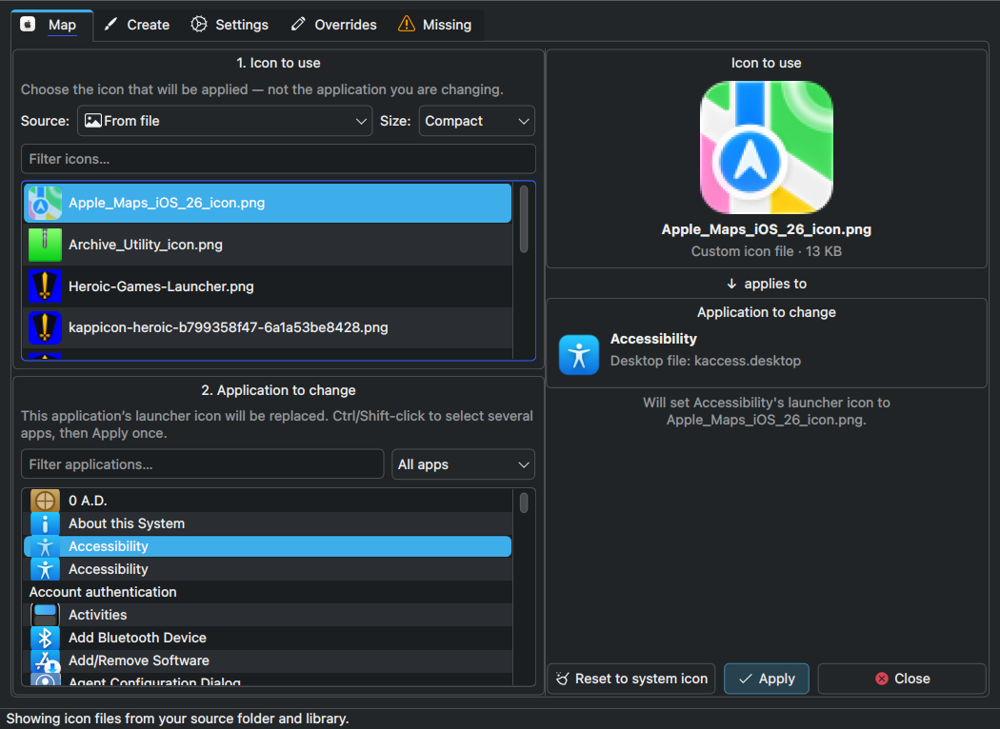
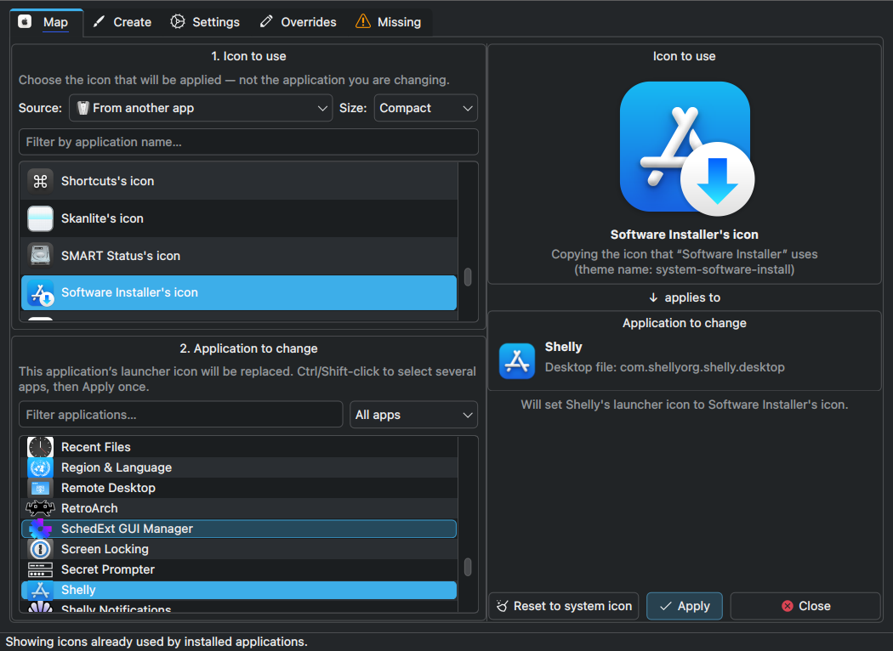
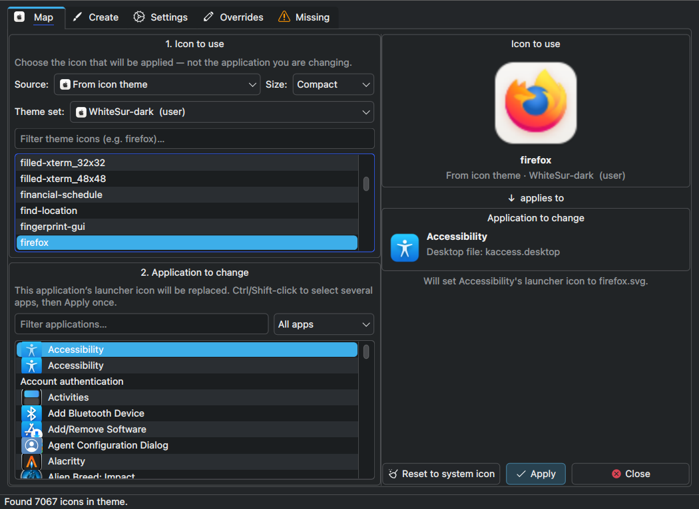
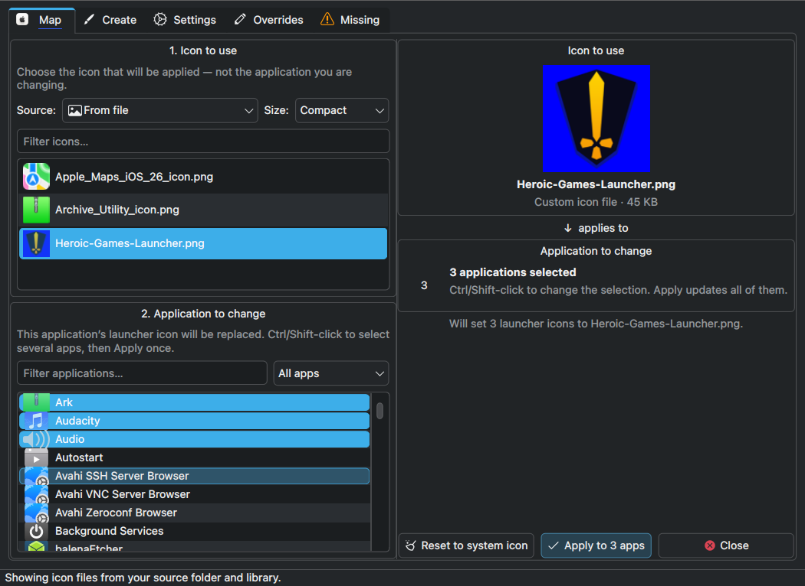
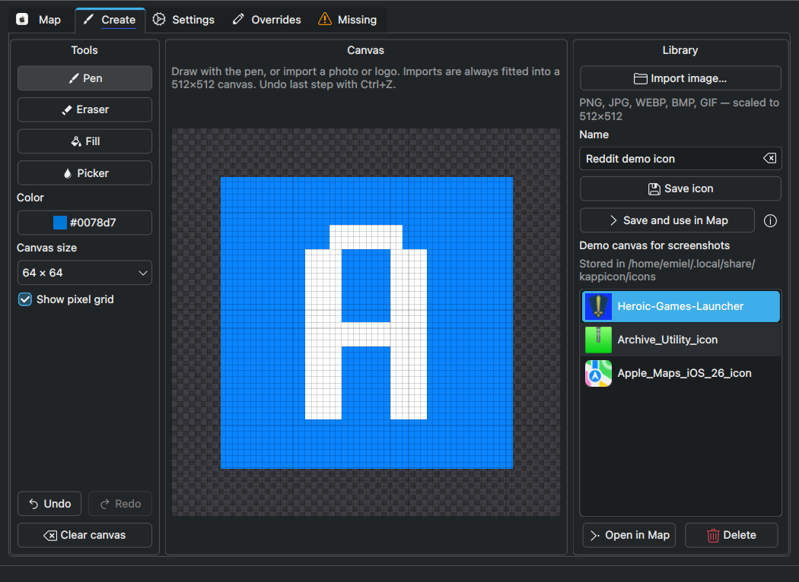
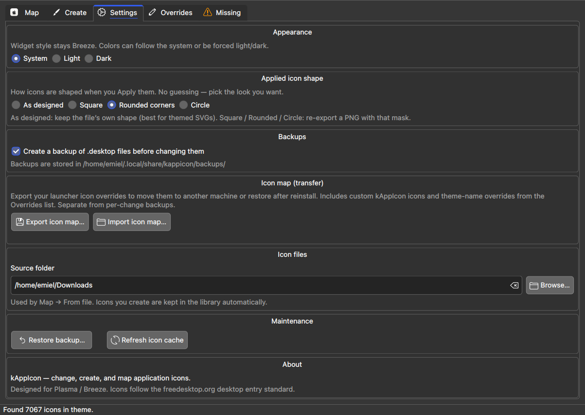
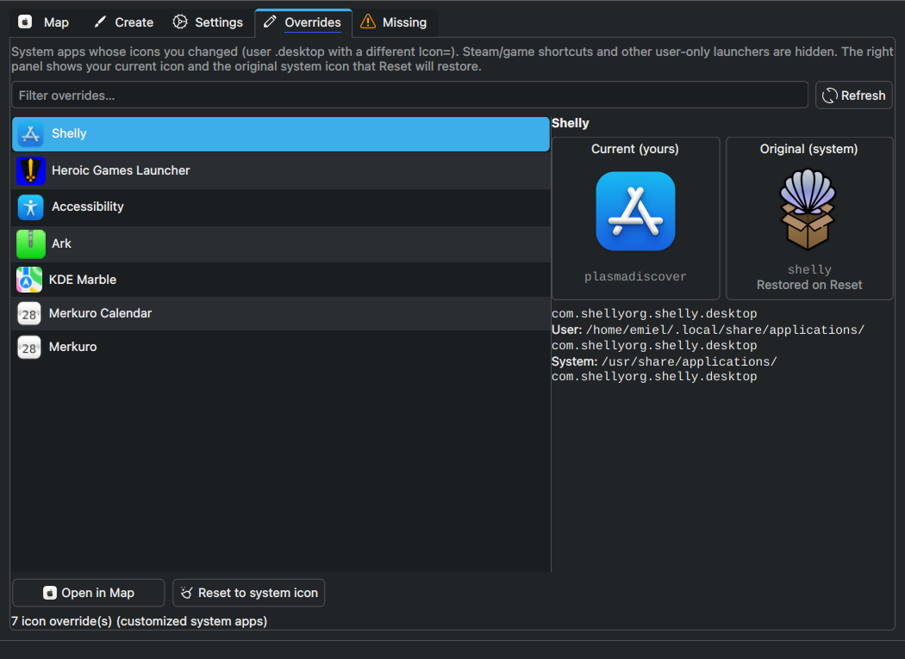
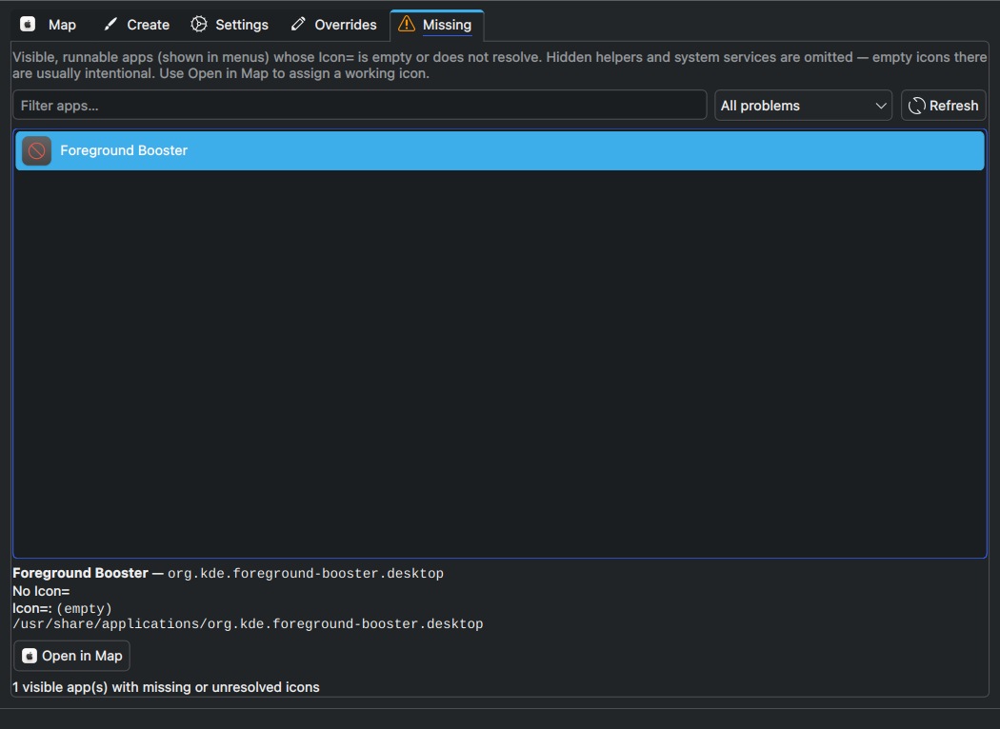
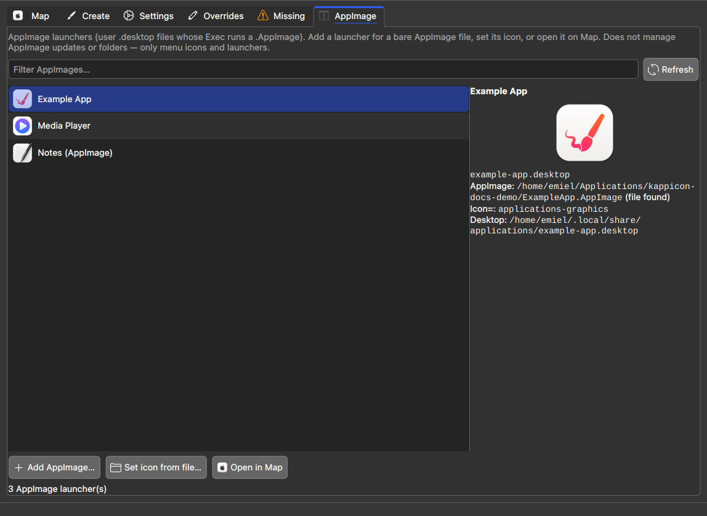

# kAppIcon

> **Literally no one:** …
>
> **Me:** Challenge accepted!

[](LICENSE)
[](https://github.com/rayman1972/kappicon/wiki/Requirements)
[](https://github.com/rayman1972/kappicon/wiki/Requirements)
[](#features)
[](https://github.com/rayman1972/kappicon/wiki/Requirements)
[](https://github.com/rayman1972/kappicon/releases)

**kAppIcon** changes **Linux app launcher icons** without root. Map a custom image, another app’s icon, or a single glyph from any installed icon theme (WhiteSur, Tela, Breeze, …) to one application at a time — without switching your whole system theme. Give **AppImages** a menu entry and a proper icon. **Export / import an icon map** to move your overrides to another machine or restore them after a reinstall.

User-level [desktop entries](https://specifications.freedesktop.org/desktop-entry-spec/) only. Built for **KDE Plasma** and other **freedesktop** desktops.

## Install

```bash
git clone https://github.com/rayman1972/kappicon.git
cd kappicon && ./install.sh
kappicon
```

**Arch Linux:** [`kappicon`](https://aur.archlinux.org/packages/kappicon) · [`kappicon-git`](https://aur.archlinux.org/packages/kappicon-git)

```bash
yay -S kappicon       # stable
yay -S kappicon-git   # latest main
```

Dependencies, updates, and distro packages → **[Installation wiki](https://github.com/rayman1972/kappicon/wiki/Installation)**

## Screenshots

### Map — from file



### Map — from another app



### Map — from icon theme



### Map — batch multi-select



### Create

Draw, import/paste, prep kit (pad, tint, mono, outline, shadow), transforms, and size previews.



### Settings

Includes appearance, icon shape, backups, **icon map export/import**, Map/AppImage folders, and maintenance.



### Overrides



### Missing



### AppImage

List AppImage menu launchers, **Add AppImage…** for a bare `.AppImage`, set its icon, or open it on Map.



→ **[AppImage wiki](https://github.com/rayman1972/kappicon/wiki/AppImage)** (what it does, what it doesn’t, Settings folder)

## Features

- **Map** from file, another app, or any installed icon theme pack
- Stay-open **Apply**, batch multi-select, session **Undo**
- **Create** — pixel editor, import/paste, prep kit (pad, tint, mono, outline, shadow), size previews, icon library
- **Overrides** (current vs system) and **Missing** icons
- **AppImage** — menu launchers for `.AppImage` files: list, add, set icon, open in Map
- **Export / import icon map** — portable zip of launcher overrides (custom `kappicon-*` icons + theme names) for reinstall or another PC (Settings · File · Overrides)
- Optional backups, icon shapes, drag-and-drop (never auto-applies)
- **CLI** (`kappicon-cli`) shares the same safe mutation engine
- User overrides only — lock, atomic writes, content-addressed icons

Full list → **[Features wiki](https://github.com/rayman1972/kappicon/wiki/Features)** · **[AppImage](https://github.com/rayman1972/kappicon/wiki/AppImage)**

## Usage

```bash
kappicon          # GUI (Map · Create · Settings · Overrides · Missing · AppImage)
kappicon-cli      # interactive CLI (fzf)
```

Tab walkthrough and CLI flags → **[Usage wiki](https://github.com/rayman1972/kappicon/wiki/Usage)**

## Documentation

| | |
|---|---|
| [Wiki home](https://github.com/rayman1972/kappicon/wiki) | Index |
| [Installation](https://github.com/rayman1972/kappicon/wiki/Installation) | Install, update, deps |
| [Requirements](https://github.com/rayman1972/kappicon/wiki/Requirements) | Python, PyQt6, tools |
| [Usage](https://github.com/rayman1972/kappicon/wiki/Usage) | GUI + CLI |
| [AppImage](https://github.com/rayman1972/kappicon/wiki/AppImage) | AppImage launchers & icons |
| [FAQ](https://github.com/rayman1972/kappicon/wiki/FAQ) | Common questions |
| [Paths](https://github.com/rayman1972/kappicon/wiki/Paths) | XDG locations |
| [How it works](https://github.com/rayman1972/kappicon/wiki/How-it-works) | Overrides, icons, safety |
| [Architecture](https://github.com/rayman1972/kappicon/wiki/Architecture) | Package layout |
| [Origins](https://github.com/rayman1972/kappicon/wiki/Origins) | History & credits |

## Contributing

See [CONTRIBUTING.md](CONTRIBUTING.md) and the [Code of Conduct](CODE_OF_CONDUCT.md).  
Security: [SECURITY.md](SECURITY.md).

## License

MIT — see [LICENSE](LICENSE).

Based on [macosicons-linux](https://github.com/system-rw/macosicons-linux) by [System RW](https://github.com/system-rw); this project is a substantial rework and expansion. Full story → [Origins](https://github.com/rayman1972/kappicon/wiki/Origins).
